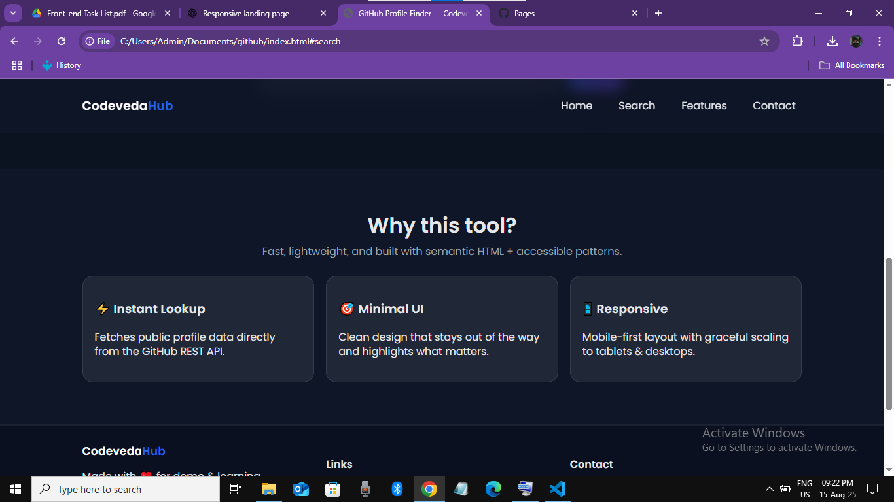
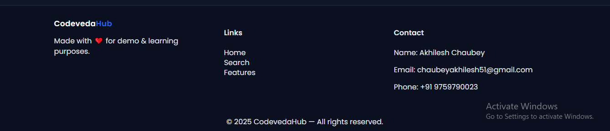

# 🚀 GitHub Profile Finder

A responsive web application to search and display **GitHub user profiles** using the **GitHub REST API**.  
It shows profile details like username, bio, followers, following, location, and repositories in a **modern, elegant, and mobile-friendly UI**.

---

## 🌐 Live Demo
🔗 **[Click here to try it!](https://akhileshchaubey51.github.io/github-profile-finder/)**

---

## 📸 Screenshots

### 🏠 Home Page




### 🔍 Profile Search Result


---

## ✨ Features
- 🔍 **Search any GitHub username** instantly.
- 📄 View **profile details** (name, bio, location, followers, following).
- 📦 **Display public repositories** with clickable links.
- 📱 **Responsive design** for mobile, tablet, and desktop.
- 🎨 Modern and clean **UI design** with smooth animations.
- ⚡ **Fast API calls** using Fetch API.

---

## 🛠️ Tech Stack
- **HTML5** – Structure of the web app
- **CSS3** – Styling and responsive design
- **JavaScript (Fetch API)** – API calls & dynamic rendering
- **GitHub REST API** – Data source

---

## 📂 Folder Structure
github-profile-finder/
│── index.html # Main HTML file
│── style.css # Styling
│── script.js # JavaScript logic
│── screenshots/ # Screenshots for README
│── README.md # Project documentation


---

## 🚀 How to Use Locally
1. **Clone the repository**
   ```bash
   git clone https://github.com/akhileshchaubey51/github-profile-finder.git

---


📬 Contact

**Name:** Akhilesh Chaubey  
**📧Email:** chaubeyakhilesh51@gmail.com  
**💻GitHub:** [akhileshchaubey51](https://github.com/akhileshchaubey51)  
**📱 Phone:** +91 9759790023

